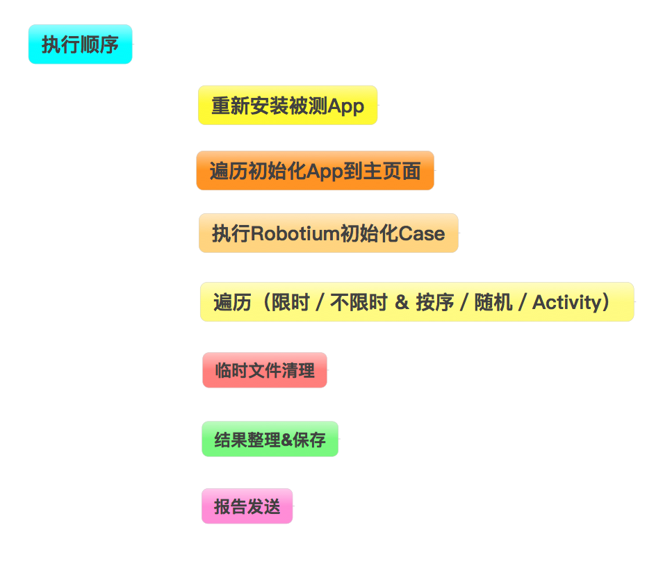
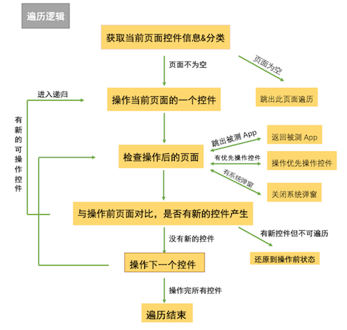
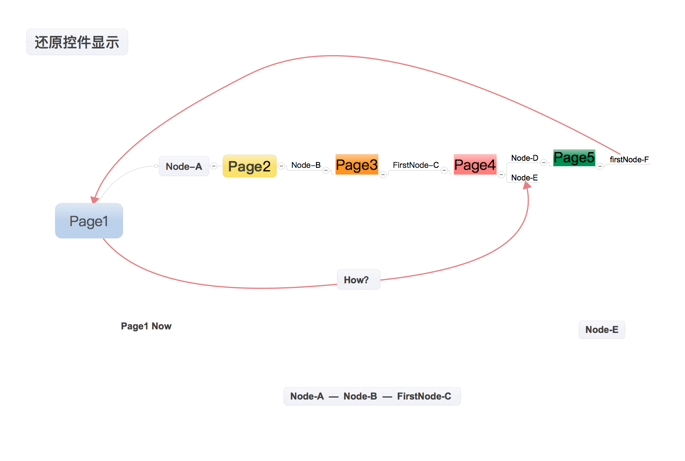
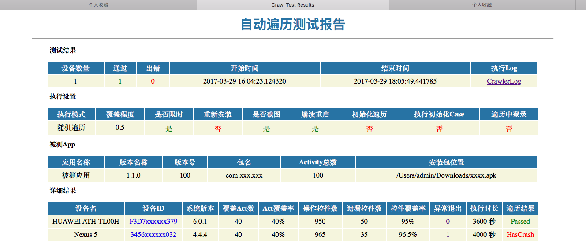

## AUICrawler
> 针对Android App 的UI遍历自动化方案 
### 快速安装
* npm install auicrawler
### 遍历方案:
#### 时间模式:
* Limit ：限定遍历时长，不包括初始化应用 & 结果统计，超过规定时长后结束
* Normal  ：不规定遍历时长，全部递归执行完成后结束
#### 遍历模式:
* Normal ： 按序遍历，多次／多设备执行的路径完全相同
* Random ： 随机遍历，可设置覆盖程度（0 <CoverageLever <=1）,在当前页面中随机抽取 覆盖百分比个 控件进行遍历
* Activity ： 遍历App的所有Activity（可无参数唤起的）
### 执行相关:
#### 执行前配置:
##### 配置文件:
- AUICrawler
  - config
    - Setting.py
##### 设置项详解:
```
SaveScreen ： 遍历过程中截图功能开关，包括还原控件显示过程截图
SaveJumpOutScreen ： 跳出遍历时截图功能开关，包括 跳出App & 进入不可遍历页面
KeepRun : 被测 App Crash／ANR 后是否继续拉起App&继续遍历

TimeModel : 时间模式 Limit／ Normal
LimitTime : 限时模式下，遍历时长，单位 秒
CrawlModel : 遍历模式  Random ／ Normal ／ Activity
CoverageLevel :  覆盖程度  0< c <=1

UnInstallApk : 是否在执行前卸载 测试App/被测App
InstallApk : 是否在执行前安装 测试App／被测App
ApkPath : 被测App 安装包路径
TestApkPath : 测试App 安装包路径 （若无测试App， 可设为空，或其他会被使用的App路径）

AppMainActivity : 被测App的主页面Activity
FirstClickViews : 有些浮层页面下方的控件也会获取到，会被无效遍历，建议提前将浮层的关闭／缩小按钮的id放入此列表，每次获取页面时，会优先点击此列表中的控件，保证遍历更有效
BackBtnViews : 返回按钮列表，在进入一个新页面时，不会优先遍历返回按钮，会在此页面所有可遍历控件遍历结束后，点击返回按钮返回，这样会提升遍历效率
UnCrawlViews : 如果在遍历过程中，发现因操作一个控件导致遍历出错或降低效率，可以将此控件的id／text放入此字典，不再操作此控件，以保证遍历效率
AuthorizationAlert : 不同App在不同品牌／不同系统的设备上使用时，会弹出系统弹窗，可前将系统弹窗允许按钮的信息存入此列表，当显示弹窗时优先处理弹窗

RunInitNodes : 若进入主页面前也会有一些可遍历的页面／控件，设置是否遍历，若关闭此开关，则需要其他方式初始化App，保证启动时直接进入主页面
RunInitCase : Robotium Case 执行开关， 关闭后在遍历前，不会执行Robotium Case
InitCases : Robotium Case 列表， 按序执行，可以将遍历前提条件的初始化Case存入其中
TestRunner : Robotium Case 执行依赖的TestRunner

Login : 执行中登录功能开关，在遍历过程中，进入到登录Activity时会登录，若想只遍历登录状态，请在初始化时执行登录Robotium Case
AppLoginActivity : 登录页面Activity， 目前只支持被测App本身的登录方式，暂不支持第三方登录
LoginViewList ：登录按钮信息，[账号输入框AccountViewID, 密码输入框PasswordViewID, 登录按钮LoginBtnId]
AccountList : 账号密码列表，执行前请保证账号足够设备1对1分配，可多不可少

SMTP_HOST : SMTP服务器地址 
Mail_To_List : 测试报告邮件发送给哪些人
Mail_User : 使用哪个邮箱账号发送测试报告
Mail_Pass : 使用的邮箱账号的登录密码
```
#### 执行脚本:
- AUICrawler
  - Crawler.py
#### 参数执行:
##### 参数：
```
-d xxxx     : 指定单设备/ 多设备列表 device1id,device2id,device3id...
-p xxx/xxx.apk : 指定被测应用的Apk目录
-t 30       : 开启限时模式 & 调整遍历限时时间 ，单位分钟
-r 0.8      : 开启随机遍历 & 设置覆盖程度
-a          : Activity遍历模式
-u          : 卸载&安装
-i          : 执行初始化 & 遍历主页面前的页面
-c          : 执行初始化Robotium Case
-s          : 只保存有效遍历操作截图
-j          : 保存还原控件显示 & 跳出App等非有效遍历截图
-k          : keepRun （Crash/ANR 后继续执行）
-l          : 遍历过程中登录
```
##### 示例场景：
1. 指定apk快速遍历

`python Crawler.py -u -p xxx/xxx/xxx.apk`

2. 指定单个设备、重新安装App、初始化App、执行Robotium Case、按序遍历10分钟 、不保存截图

`python Crawler.py -d deviceid -t 10 -uic` 

3. 指定多个设备，不重新安装App、不初始化、覆盖程度0.5随机遍历5分钟、保存有效遍历截图、Crash后重启继续执行、遍历过程中登录

`python Crawler.py -d deviceid1,deviceid2,deviceid3 -t 5 -r 0.5 -skl`

4. 使用当前连接的所有设备、重新安装App、初始化App、不执行Robotium Case、遍历所有无参数Activity、不限时、保存所有截图

`python Crawler.py -uisj`

* 自由组合参数执行，默认执行模式：所有设备、不重新安装、不初始化、按序执行所有控件、不截图、Crash／ANR就停止、过程中不登录
* 可以修改Setting调整默认的执行模式

#### 执行方案:
```
1. 支持多设备同时执行（多线程执行，每个设备单个线程）
2. 初始化App（针对首次启动有需滑动的Guide页的App，优先向左滑动到有可点击的控件显示；会遍历进入主页面前显示的控件至进入Setting中设置的主页面）
3. 支持执行Robotium Case（主要是用来再初始化App至满足想要的遍历条件，比如遍历前先登录 ／ 解决一些可能会影响遍历的操作）
4. 启动主页面按所选模式开始遍历
```
#### 执行顺序：

#### 遍历逻辑：

#### 还原要操作的控件显示

#### 执行时可能会遇到的现象:
```
1. 反复进入一个页面，但操作的控件并不同：可能是操作后页面变化，导致下一个需要操作的控件没有正确显示，需要返回再还原其显示
2. 长时间未操作：出现此问题时请查看设备详细Log，从上一次正常操作后查看Log, 可能是操作后，页面变化较大，不能找到后续的很多控件的还原路径
```
#### 关于截图
```
1.截图时长为2秒左右，稍长，若为提高执行速度，可以在Setting中关闭所有截图
2.每张截图大小为100-350 KB，可以在Setting中设置SaveJumpOutScreen=False，减少截图数量，缩小所占空间
3.有效遍历截图，会在操作前将控件区域高亮显示
```
### 脚本结构:
#### 封装的模块:
##### 所在目录:
- AUICrawler
  - module
##### 模块介绍:
```
PlanInfo :  本次执行的相关配置 & 运行状态等信息 
CrawledApp :  当次执行时使用的App本身信息 & 遍历中相关状态&信息 
DeviceInfo :  每个执行的Device的本身信息 & 遍历中相关状态&信息 
PageInfo :  每次获取时的页面信息 & 遍历中相关状态&信息 
NodeInfo :  每个控件的获取时信息 & 遍历中相关状态&信息
```
#### 执行记录:
##### 目录结构:
- AUICrawler
  - result
    - 2017xxxxxxxxxx : 目录名称时间执行的测试计划
      - CrawlerLog.txt : 计划执行时主要Log
      - Result.html : 测试报告
      - 设备ID
        - CrawlerLog.txt : 此设备执行时详细Log
        - Screenshot : 截图存储目录
        - Uidump.xml : 运行中获取页面信息生成的临时文件，计划执行结束时会删除
#### 测试报告
##### 样板

##### 本地目录
- AUICrawler
  - result
    - 2017xxxxxxxxxx
      - Result.html 
##### 超链跳转
```
执行Log : 打开当次计划执行Log
设备ID : 对应设备的存储目录
异常退出 : 对应设备的logcat
遍历结果 : 对应设备的遍历详细Log
```
##### 发送邮件报告
```
在Setting.py中配置邮件信息
遍历结束后将报告发送给对应的接收人
不设置不会发送，不会报异常
```
##### 邮件报告显示
> 不同的邮件客户端 ／ 浏览器，邮件显示会不同
> html临时接触，所以在显示时可能会有些小问题， 如果有前辈可以帮助调整可以联系我，教教我，谢谢
### 开发进度:
- [x] 1.  架构设计
- [x] 2.  递归逻辑
- [x] 3.  配置信息
- [x] 4.  限时模式
- [x] 5.  随机遍历模式  （请提前在Setting中设置 功能开关 & 覆盖程度）
- [x] 6.  Activity模式  (现只遍历无参数可启动的Activity，若执行Activity模式，请先初始化&安装开关是否需要开启)
- [x] 7.  对Clickable的控件遍历   （点击，产生的新有效控件会被遍历）
- [x] 8.  对LongClickable的控件遍历 （长按，产生的新有效控件会被遍历）
- [x] 9.  对EditText的遍历 (随机输入字符，输入字符后的EditText不会再遍历，产生的其他新有效控件会被遍历)
- [ ] 10. 对Scrollable的控件的遍历 (降低优先级，暂时感觉列表的滚动的用处并不大，反而产生不必要的遍历，增加了遍历时长)
- [x] 11. 执行结果收集&统计&展示
- [x] 12. 遍历过程中，遍历到登录页面登录功能 (支持多设备登录，请在Setting中设置足够的账号信息)
- [x] 13. 命令行参数执行
- [ ] 14. webView遍历 （现在只是对UI控件遍历，未遍历WebView内容，准备补充WebView遍历，若有知道有哪些模块可以获取WebView（除类似Appium这种框架），欢迎告知
- [x] 15. 邮件发送测试报告
- [x] 16. 优化截图重绘方案 （虽然没有更换方案前也差不多解决了内存疯涨的问题，但是自己写的新方法还是更省时间和内存一些）
- [x] 17. Crash时及时发送携带logcat附件的邮件，及时反馈问题
- [x] 18. 操作导致应用异常结束，再次还原此操作，查看是否再次异常结束 & 发送结果邮件。

> QQ：553410327 ，欢迎前辈指导，同学交流 
